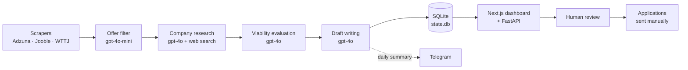

# Job Application Multi-Agent System

🇪🇸 [Versión en español](README.md)

A multi-agent system that automates the job hunt for AI / data / engineering
roles in Spain. Every day it scans job boards, evaluates each posting,
researches the company, and drafts personalised applications in Spanish (email
+ cover letter), surfaced in a dashboard for human review.

**Guiding principle — human-in-the-loop.** The system **never sends anything
automatically**. It prepares drafts; the user reviews, edits, and decides.
Drafts never disclose AI assistance unless the user opts into an optional P.S.

## Contents

- [Architecture](#architecture)
- [Tech stack](#tech-stack)
- [Run locally](#run-locally)
- [Add a user](#add-a-user)
- [Scheduling](#scheduling)
- [Estimated cost](#estimated-cost)
- [Limitations & scope](#limitations--scope)
- [License & contact](#license--contact)

## Architecture

The orchestrator chains the agents per user; state lives in SQLite and is
reviewed from the dashboard.



## Tech stack

- **Language / manager**: Python 3.11+, [`uv`](https://docs.astral.sh/uv/).
- **LLM**: `openai` SDK against Azure OpenAI (`gpt-4o-mini`, `gpt-4o`).
- **Web search**: Bing Search v7 with a DuckDuckGo runtime fallback.
- **Scraping**: `httpx` + `beautifulsoup4`; `playwright` for JS-heavy sites.
- **Data**: `sqlalchemy` 2.x + SQLite + Alembic; `pydantic` v2 models.
- **Quality**: `pytest`/`pytest-asyncio`/`respx`, `mypy --strict`, `ruff`.
- **Dashboard**: Next.js 14, TypeScript, Tailwind, shadcn/ui (pnpm).
- **Infra**: GitHub Actions (cron), Telegram notifications.

## Run locally

```bash
uv sync --extra dev
cp .env.example .env                              # fill keys (CLAUDE.md §5)
uv run python -m src.cli db init                  # create + migrate DB
uv run python -m src.cli profile load --user jorge
uv run python -m src.cli orchestrator run --all-users
```

Dashboard + API, in **two terminals** from the repo root:

```bash
uv run uvicorn api.main:app --reload              # API  :8000
cd dashboard && pnpm install && pnpm dev          # UI   :3000
```

See [`dashboard/README.md`](dashboard/README.md),
[`api/README.md`](api/README.md), [`docs/operations.md`](docs/operations.md).

## Add a user

Profiles are YAML at `config/users/<username>.yaml` (gitignored; only
`*.example` are tracked).

```bash
cp config/users/jorge.yaml.example config/users/new.yaml
# edit new.yaml, then:
uv run python -m src.cli profile load --user new
```

## Scheduling

[`.github/workflows/daily-run.yml`](.github/workflows/daily-run.yml) runs at
**05:00 UTC** (06:00 CET winter / 07:00 CEST summer; single cron, DST drift
documented inline). Each run restores data from the `data` branch, migrates,
runs `orchestrator run --all-users`, pushes `state.db` + `drafts/` back, and
posts a Telegram summary (plus a cost alert if the run exceeds
`DAILY_COST_ALERT_EUR`). Manual `workflow_dispatch` with a dry-run toggle.

## Estimated cost

With 2 users and normal volume, Azure OpenAI cost is roughly **€0.05–0.50 per
day** (most spend is company research + drafting on `gpt-4o`; filtering uses
the cheaper `gpt-4o-mini`, and prompt caching trims the stable CV/instructions).
A Telegram alert fires if a single run exceeds **€1.00** (`DAILY_COST_ALERT_EUR`).

## Limitations & scope

- **Flow A (cold outreach to companies with no posted offer) is out of scope.**
  Not built, not stubbed.
- **LinkedIn is never scraped directly.** People discovery (Phase 11) uses
  public web-search results only.
- **The system never sends anything** — drafts only; sending is manual.
- No dashboard auth in v1 (a user picker between 2 profiles).
- SQLite only; no external or vector database.

## License & contact

Personal / portfolio project. No open license yet — please ask before reusing.

Contact: **Jorge Pulgar** · <jpulgar111@gmail.com>
