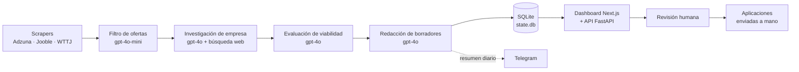

# Job Application Multi-Agent System

🇬🇧 [English version](README.en.md)

Sistema multi-agente que automatiza la búsqueda de empleo para roles de IA,
datos e ingeniería en España. Cada día escanea portales de empleo, evalúa cada
oferta, investiga la empresa y redacta borradores personalizados en español
(email + carta de presentación), que luego se revisan en un dashboard.

**Principio rector — humano en el bucle.** El sistema **nunca envía nada
automáticamente**. Prepara borradores; la persona revisa, edita y decide. Los
borradores no mencionan asistencia de IA salvo que el usuario active una P.D.
opcional desde el dashboard.

## Tabla de contenidos

- [Arquitectura](#arquitectura)
- [Stack tecnológico](#stack-tecnológico)
- [Cómo arrancar localmente](#cómo-arrancar-localmente)
- [Cómo añadir un nuevo usuario](#cómo-añadir-un-nuevo-usuario)
- [Scheduling (ejecución diaria)](#scheduling-ejecución-diaria)
- [Coste estimado](#coste-estimado)
- [Limitaciones y alcance](#limitaciones-y-alcance)
- [Licencia y contacto](#licencia-y-contacto)

## Arquitectura

El orquestador encadena los agentes por usuario; el estado vive en SQLite y se
revisa desde el dashboard.



- **Orquestador** (`src/orchestrator.py`) — itera usuarios y ejecuta la
  cadena scrape → filter → research → evaluate → write.
- **Agentes** (`src/agents/`) — un scraper por plataforma, filtro de ofertas,
  investigador de empresa, evaluador de viabilidad y redactor de borradores.
- **Base de datos** — SQLite vía SQLAlchemy 2.x + Alembic.
- **Dashboard** — Next.js 14 (App Router) + API FastAPI que lee la SQLite.
- **Scheduler** — workflow de GitHub Actions (cron diario).
- **Notificaciones** — resumen por Telegram al final de cada ejecución.

## Stack tecnológico

- **Lenguaje / gestor**: Python 3.11+, [`uv`](https://docs.astral.sh/uv/).
- **LLM**: SDK `openai` contra Azure OpenAI (`gpt-4o-mini` y `gpt-4o`).
- **Búsqueda web**: Bing Search v7, con fallback a DuckDuckGo en runtime.
- **Scraping**: `httpx` + `beautifulsoup4`; `playwright` para sitios con JS.
- **Datos**: `sqlalchemy` 2.x + SQLite + Alembic; modelos `pydantic` v2.
- **Utilidades**: `structlog`, `click`, `pyyaml`, `python-dotenv`, `rapidfuzz`.
- **Calidad**: `pytest` + `pytest-asyncio` + `respx`, `mypy --strict`, `ruff`.
- **Dashboard**: Next.js 14, TypeScript, Tailwind, shadcn/ui (pnpm).
- **Infra**: GitHub Actions (cron), Telegram (notificaciones).

## Cómo arrancar localmente

```bash
# 1. Instalar uv
powershell -c "irm https://astral.sh/uv/install.ps1 | iex"   # Windows
# curl -LsSf https://astral.sh/uv/install.sh | sh            # macOS/Linux

# 2. Dependencias
uv sync --extra dev

# 3. Configurar entorno
cp .env.example .env        # rellena las claves (ver CLAUDE.md §5)

# 4. Inicializar la base de datos
uv run python -m src.cli db init

# 5. Cargar perfiles de usuario (ver siguiente sección)
uv run python -m src.cli profile load --user jorge
```

Ejecutar el pipeline:

```bash
uv run python -m src.cli orchestrator run --user jorge      # un usuario
uv run python -m src.cli orchestrator run --all-users       # todos
```

Levantar dashboard + API (en **dos terminales**, desde la raíz):

```bash
# Terminal 1 — API (http://localhost:8000)
uv run uvicorn api.main:app --reload

# Terminal 2 — dashboard (http://localhost:3000)
cd dashboard && pnpm install && pnpm dev
```

Más detalle en [`dashboard/README.md`](dashboard/README.md),
[`api/README.md`](api/README.md) y [`docs/operations.md`](docs/operations.md).

## Cómo añadir un nuevo usuario

Los perfiles son YAML en `config/users/<username>.yaml` (gitignored; solo se
versionan los `*.example`).

```bash
cp config/users/jorge.yaml.example config/users/nuevo.yaml
# Edita nuevo.yaml: datos personales, roles objetivo, stack, red flags, CV…
uv run python -m src.cli profile load --user nuevo
```

`profile load` valida el YAML (Pydantic) e inserta/actualiza la fila en la tabla
`users`. El dashboard lo mostrará en el selector de usuario.

## Scheduling (ejecución diaria)

El workflow [`.github/workflows/daily-run.yml`](.github/workflows/daily-run.yml)
se ejecuta a las **05:00 UTC** (06:00 CET en invierno, 07:00 CEST en verano;
un único cron, la deriva por horario de verano está documentada en el archivo).

Cada ejecución: restaura los datos de la rama `data`, aplica migraciones, corre
`orchestrator run --all-users`, persiste `state.db` + `drafts/` de vuelta a la
rama `data`, y envía un resumen por Telegram (más una alerta de coste si supera
`DAILY_COST_ALERT_EUR`). También se puede lanzar a mano (`workflow_dispatch`)
con un toggle de *dry run*. Ver [`docs/operations.md`](docs/operations.md).

## Coste estimado

Con 2 usuarios y volumen normal de ofertas, el coste de Azure OpenAI ronda
**0,05–0,50 € por día** (la mayoría del gasto es la investigación de empresa y
la redacción con `gpt-4o`; el filtrado usa el más barato `gpt-4o-mini`, y el
caching de prompts reduce el coste del CV/instrucciones estables). El sistema
envía una alerta por Telegram si una ejecución supera **1,00 €** (configurable
con `DAILY_COST_ALERT_EUR`).

## Limitaciones y alcance

- **Flow A (contacto en frío a empresas sin oferta publicada) está fuera de
  alcance.** No se implementa ni se deja preparado.
- **Nunca se scrapea LinkedIn directamente.** El descubrimiento de personas
  (Fase 11) usa solo resultados de búsqueda web pública.
- **El sistema nunca envía nada.** Solo prepara borradores; el envío es manual.
- Sin autenticación en el dashboard (v1): selector de usuario entre 2 perfiles.
- Solo SQLite; sin base de datos externa ni vectorial.

## Licencia y contacto

Proyecto personal / de portfolio. Sin licencia abierta por ahora — pregunta
antes de reutilizar.

Contacto: **Jorge Pulgar** · <jpulgar111@gmail.com>
