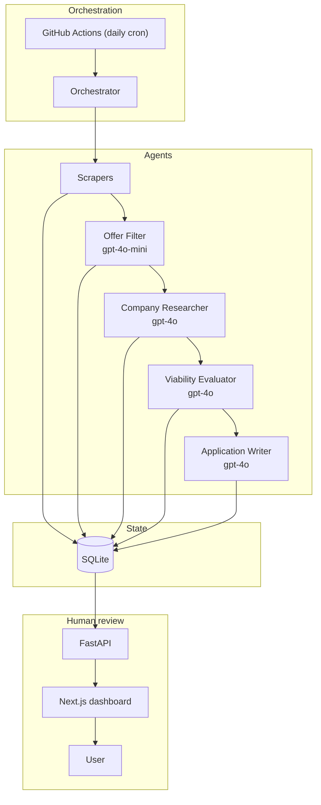

# Architecture

🇪🇸 [Versión en español](architecture.md)

Brief English version of the [Spanish architecture doc](architecture.md), for
technical readers and portfolio reviewers. To run the system, see the
[README](../README.en.md).

## Overview

A batch pipeline (not a real-time service). An orchestrator runs a chain of
specialised agents per user; each stage persists its result to SQLite, so state
is inspectable and stages are isolated and resumable.

## Why multi-agent, not one prompt

- **Cost**: each stage uses the right model — `gpt-4o-mini` for the
  high-volume binary filter, `gpt-4o` for research/evaluation/writing.
- **Fault isolation**: a per-offer `try/except` means one bad offer doesn't
  abort the batch; the row is marked `error`.
- **Inspectable state**: intermediate results persist and are auditable.
- **Simpler, cacheable prompts**: short focused instructions; the user CV and
  stable system messages are prompt-cached.
- **Clean human-in-the-loop**: the final stage emits a draft; sending is a
  separate human action.

## Key design decisions

- **SQLite + SQLAlchemy + Alembic** — 2 users, low volume, one daily run; the
  whole file is version-controlled to persist between runs.
- **No RAG / no vector DB in v1** — company research yields a structured
  Pydantic dossier injected directly into later prompts; there's no corpus to
  retrieve from.
- **Prompt caching** for the stable CV/system messages.
- **`gpt-4o-mini` vs `gpt-4o`** split by mechanical vs reasoning work.
- **Human-in-the-loop** — the system never sends.

## Anti-decisions

- **No vector DB** — no semantic-retrieval use case; structured dossiers suffice.
- **No Flow A (cold outreach)** — out of scope by design (focus, spam/ToS risk).
- **No LinkedIn scraping, ever** — public web search only.
- **No dashboard auth (v1)** — a 2-profile picker.

## State persistence

Canonical state is `data/state.db` + `data/drafts/`. In CI (ephemeral runners)
it lives on a dedicated **`data` branch**, restored at start and committed at
end (`scripts/sync_data_branch.sh`). Dedup: `offers.hash_unico` = sha256 of
normalized `titulo + empresa + ubicacion`; near-duplicates via `rapidfuzz`.

## Output QA

Banned-words check + specificity rule after generation; max 2 regenerations,
else the draft is flagged `needs_manual_context`. The email body never discloses
AI; the P.S. is user-opt-in only.

## Error handling

Per-offer `try/except` (mark `error`, store class+truncated message, no PII);
fatal per-user errors write a `failed` `run_logs` row; the Telegram notifier
swallows all failures so it can't break a run. Nothing is silently ignored.

## Risks & mitigations

| Risk | Mitigation |
| --- | --- |
| Platform ToS | Official APIs where available; respect robots.txt + rate limits; never scrape LinkedIn. |
| Throttling / 429 | Web-search rate limiter; `asyncio.Semaphore` on concurrent LLM calls; Telegram `retry_after`. |
| Filter false positives | Cheap recall-leaning filter; human review is the final safety net. |
| Runaway cost | Per-run usage tracker + Telegram alert above `DAILY_COST_ALERT_EUR`. |
| PII in logs | Emails/phones masked; errors store class + truncated message only. |
