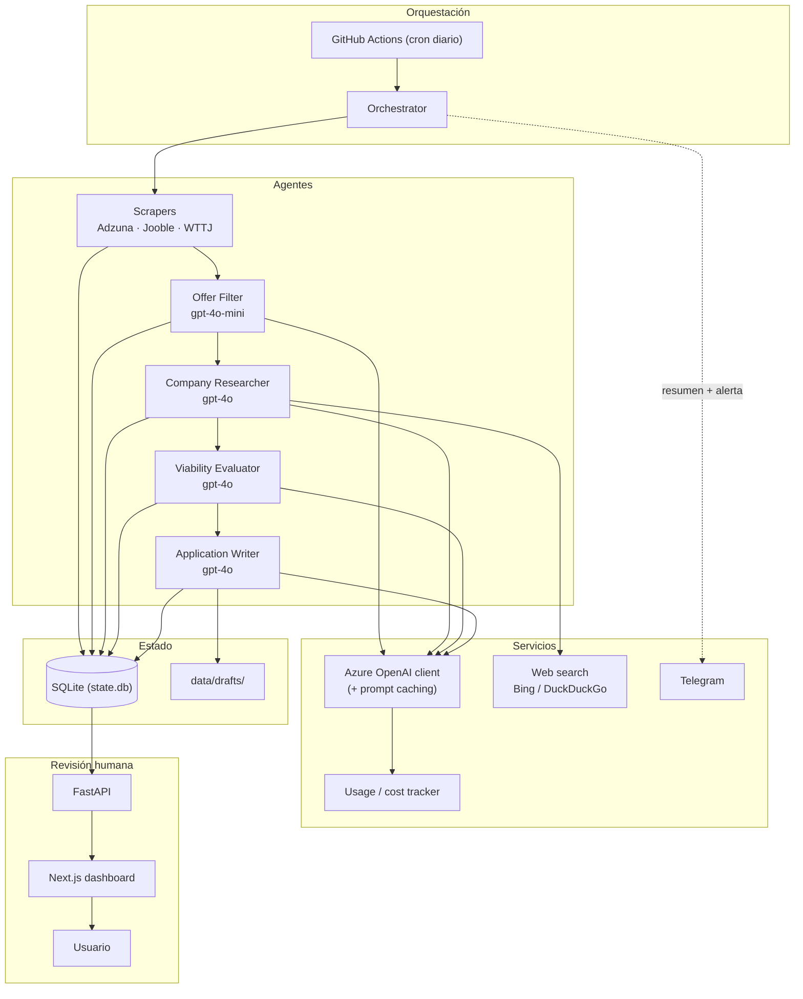

# Arquitectura

🇬🇧 [English version](architecture.en.md)

Documento técnico para lectores que quieran entender *por qué* el sistema está
construido así, no solo *qué* hace. Para arrancarlo, ver el
[README](../README.md).

## Visión general

El sistema es un pipeline por lotes, no un servicio en tiempo real. Un
orquestador lanza una cadena de agentes especializados por usuario; cada etapa
deja su resultado en SQLite, de modo que el estado es inspeccionable y las
etapas son reanudables y aisladas entre sí.

## Por qué multi-agente y no un solo prompt

Dividir el pipeline en agentes especializados aporta:

- **Coste**: cada etapa usa el modelo adecuado. El filtrado (decisión binaria,
  alto volumen) usa `gpt-4o-mini`; investigación, evaluación y redacción usan
  `gpt-4o`. Un prompt único obligaría a usar el modelo caro para todo.
- **Aislamiento de fallos**: un error en una oferta no tumba el lote. Cada etapa
  captura excepciones por oferta y marca esa fila como `error` sin abortar.
- **Estado inspeccionable**: el resultado intermedio (oferta filtrada, dossier,
  evaluación) se persiste y se puede auditar o reanudar.
- **Prompts más simples y cacheables**: instrucciones cortas y enfocadas, con el
  CV del usuario y los system messages estables servidos desde caché.
- **Human-in-the-loop limpio**: la última etapa produce un borrador; el envío es
  una acción humana separada, nunca automática.

## Decisiones de diseño clave

- **SQLite + SQLAlchemy + Alembic**: 2 usuarios, volumen bajo, una ejecución
  diaria. SQLite es suficiente, sin servidor que operar, y el fichero entero se
  versiona para persistirlo entre runs.
- **Sin RAG / sin recuperación semántica en v1**: la investigación de empresa
  produce un **dossier estructurado** (Pydantic) que se inyecta directamente en
  los prompts posteriores. No hay un corpus que consultar; añadir embeddings
  sería complejidad sin beneficio.
- **Prompt caching**: el CV del usuario y los system messages estables se marcan
  para caché, reduciendo el coste por token de la parte invariante.
- **`gpt-4o-mini` vs `gpt-4o`**: mecánico/clasificación vs razonamiento/escritura
  (ver arriba).
- **Human-in-the-loop**: el sistema nunca envía. Prepara; la persona decide.
- **Prompts en español, externos al código** (`src/prompts/*.md`), cargados en
  runtime — nunca hardcodeados.

## Anti-decisiones (lo que deliberadamente NO hacemos)

- **Sin base de datos vectorial**: no hay caso de uso de recuperación semántica
  en v1/v1.1; los dossiers estructurados cubren la necesidad. Evita un servicio
  extra que operar y pagar.
- **Sin Flow A (contacto en frío sin oferta publicada)**: fuera de alcance por
  diseño — no se implementa ni se deja preparado. Razones: foco del producto,
  menor señal y mayor riesgo de spam/ToS.
- **Sin scraping de LinkedIn**: nunca, bajo ninguna circunstancia. El
  descubrimiento de personas (Fase 11) usa solo búsqueda web pública.
- **Sin auth en el dashboard (v1)**: selector entre 2 perfiles; añadir auth no
  aporta a un uso personal.

## Persistencia del estado entre ejecuciones

- El estado canónico es `data/state.db` (SQLite) más `data/drafts/`.
- En CI (runners efímeros) se persiste en una **rama `data`** dedicada: el
  workflow la restaura al inicio y hace commit/push al final
  (`scripts/sync_data_branch.sh`, ver [operations.md](operations.md)).
- **Deduplicación**: `offers.hash_unico` = sha256 de `titulo + empresa +
  ubicacion` normalizados. Los casi-duplicados dentro de un mismo scrape se
  detectan con `rapidfuzz`. Así, re-ejecutar no genera ofertas repetidas.
- Cada ejecución escribe una fila en `run_logs` (contadores, tokens, coste,
  estado).

## QA del output generado

- **Lista de palabras prohibidas**: clichés corporativos y tells de IA se
  comprueban tras la generación (además de pedirlo en el prompt).
- **Regla de especificidad**: el borrador debe referenciar al menos un hecho
  concreto de la empresa; si no, se marca para contexto manual.
- **Reintentos**: máximo 2 regeneraciones. Si sigue fallando lint/especificidad,
  el draft queda en estado `needs_manual_context` en vez de enviar algo genérico.
- **Disclosure**: el cuerpo del email nunca menciona la IA; la P.D. es opcional y
  la activa el usuario desde el dashboard, nunca el agente.

## Manejo de errores

- **Por oferta**: `run_per_offer` ejecuta cada etapa con un `try/except` que
  aísla el fallo, marca `offer.estado = "error"` y guarda `error_note` con la
  clase y el mensaje recortado (sin stack trace, sin PII). `KeyboardInterrupt` y
  `SystemExit` se propagan.
- **Fatal por usuario**: si una excepción tumba la sesión, se escribe un
  `run_logs` con `estado=failed` antes de devolver un `RunResult`.
- **Notificador**: `telegram.send_message` traga cualquier fallo (incl. config
  ausente) — un fallo de notificación nunca debe tumbar la ejecución.
- **Sin manejo silencioso**: se loguea y se re-lanza, o se loguea y se marca el
  estado como `error`. Nada se ignora en silencio.

## Riesgos y mitigaciones

| Riesgo | Mitigación |
| --- | --- |
| Violar ToS de plataformas | APIs oficiales cuando existen (Adzuna, Jooble); respetar robots.txt y rate-limit; **nunca** scrapear LinkedIn. |
| Throttling / 429 | Rate limiter en `web_search`; `asyncio.Semaphore` que limita llamadas LLM concurrentes; reintento con `retry_after` en Telegram. |
| Falsos positivos del filtro | El filtro barato prioriza recall; la revisión humana es la red de seguridad final; relevantes vs descartados quedan logueados. |
| Coste descontrolado | `usage_tracker` por ejecución + alerta Telegram si supera `DAILY_COST_ALERT_EUR`. |
| Fuga de PII en logs | Emails y teléfonos se enmascaran; los errores guardan clase+mensaje recortado, no payloads. |
